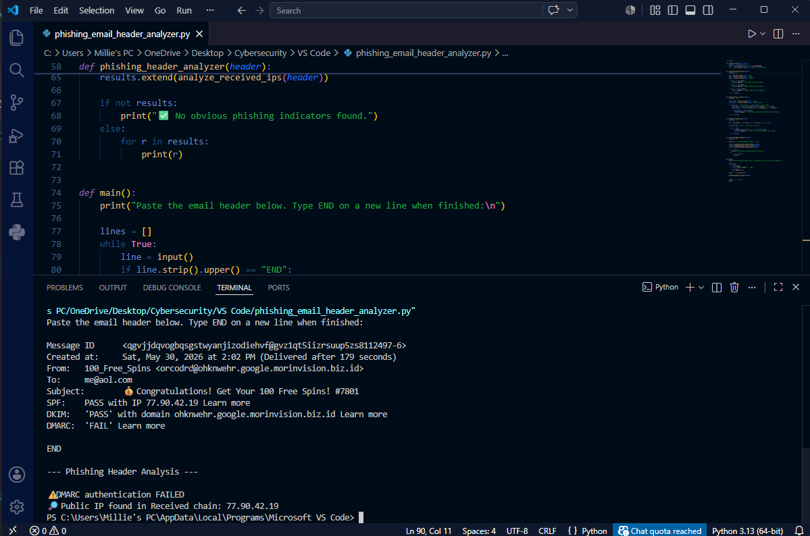

# Email Header Analyzer
## CTI Analyst Tool | SPF / DKIM / DMARC Inspection | Sender Infrastructure Analysis

**Author:** Millie Altman

**Language:** Python 3.x  
**Dependencies:** `re` (standard library — no install required)  
**Status:** v1  

---

## The Problem

Manual email header inspection is a core phishing triage task — but parsing raw headers to check authentication results, identify sender/return-path mismatches, and extract originating IPs is tedious and error-prone at volume. A single missed SPF failure or domain mismatch can mean a malicious email gets cleared.

This tool automates the inspection workflow, flagging authentication failures and infrastructure anomalies in seconds.

---

## CTI Application

This tool was used during the analysis documented in the [Phishing Campaign Intelligence Report (SOC-IR-2026-017)](https://github.com/millie-altman/threat-intelligence-portfolio/blob/main/finished-intelligence/phishing-triage-report.md).

Headers from the phishing email sent to `j.smith@bluestripetech.com` were analyzed using this script, which confirmed SPF failure, DMARC failure, a From/Return-Path domain mismatch, and a public originating IP — all consistent with spoofed phishing infrastructure.

---

## Detection Capabilities

| Check | What It Detects | Phishing Signal |
|---|---|---|
| SPF result | Whether sending IP is authorized for the domain | FAIL = unauthorized sender |
| DKIM result | Whether email has valid cryptographic signature | FAIL/NONE = unsigned, unverifiable |
| DMARC result | Whether domain passes policy alignment | FAIL = domain impersonation likely |
| From / Return-Path mismatch | Sender domain differs from bounce address | Common spoofing indicator |
| Public IP in received chain | Extracts non-private IPs from routing headers | Identifies originating infrastructure |

---

## Usage

```bash
# Run the script
python header_analysis_script.py

# Paste raw email headers at the prompt
# Type END on a new line when finished
```

**Example session:**

```
Paste the email header below. Type END on a new line when finished:

From: security-alert@microsoft-support.com
Return-Path: attacker@malicious-domain.ru
Received: from 185.234.219.10
spf: fail
dkim: none
dmarc: fail
END

--- Phishing Header Analysis ---

⚠️ SPF authentication FAILED
⚠️ DMARC authentication FAILED
⚠️ From domain does NOT match Return-Path domain
🔎 Public IP found in Received chain: 185.234.219.10
```

**Example output screenshot:**



---

## How to Get Raw Email Headers

**Gmail:** Open email → three-dot menu → "Show original"  
**Outlook:** Open email → File → Properties → Internet headers  
**Apple Mail:** View → Message → All Headers  

Copy the full header block and paste it at the tool prompt.

---

## Planned Improvements

- **IP reputation lookup** — automatically query AbuseIPDB or VirusTotal for the originating IP
- **Domain age check** — WHOIS lookup on sender domain to flag recently registered addresses
- **Bulk header analysis** — accept multiple header files for batch processing
- **Structured JSON output** — machine-readable results for SIEM or case management ingestion
- **DMARC policy parsing** — retrieve and display the domain's actual DMARC policy record for additional context

---

## Skills Demonstrated

- Python scripting for security automation
- Email authentication protocol understanding (SPF, DKIM, DMARC)
- Regex-based log and header parsing
- Phishing infrastructure identification
- CTI analyst triage workflow automation
